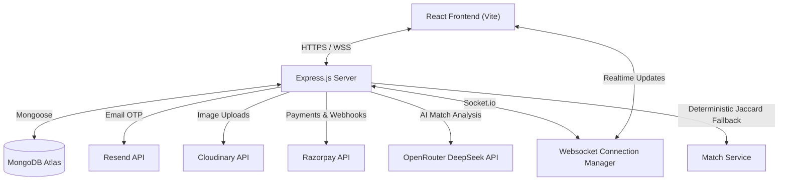
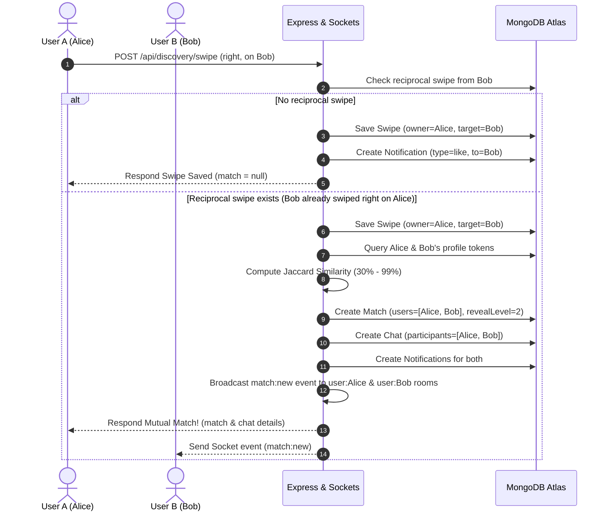
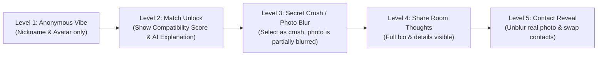

# Nexora 🚀
> **Nexora** is a production-ready, full-stack, campus-exclusive social ecosystem designed for verified college students in India.

By blending anonymous-first interactions with progressive reveal mechanics, Nexora provides a secure yet exciting social environment. It brings together swipe deck discovery, real-time chat, mood-based public chatrooms, secret crush matching, approximate zone-based radar, tiered premium services (Razorpay), dynamic similarity compatibility indexing, safety moderation, and a robust admin dashboard.

---

## 📸 System Architecture & Information Flows

### 1. General System Topology & Integrations


### 2. Swipe-to-Match Logic & WebSocket Lifecycle


### 3. Progressive Reveal Levels Architecture


---
## 🌟 Nexora


---
## 🌟 Key Features & Technical Details

### 1. Domain-Gated Authentication & Verification
- **Verified Signup:** Gatekeep registration through verified campus-specific email domains (e.g., `student@iitd.ac.in`).
- **Resend OTP Integration:** Uses the [email.service.js](file:///d:/Nexora/backend/server/services/email.service.js) to trigger verification codes using Resend with an automatic fallback mechanism.
- **Secure Session Management:** Dual JWT architecture serving access & refresh tokens via secure, signed HttpOnly cookies to protect from XSS compromises.
- **Onboarding Flow:** Interactive onboarding capturing nickname, bio, academic details, and personal prompts.

### 2. Campus Discover & Compatibility Matching
- **Swipe-Deck Cards:** Rich, interactive swipe cards showing vibe tags, prompts, interest metrics, and online/offline status.
- **College Isolation:** Discovery is strictly restricted to students from the user's verified college to guarantee complete campus privacy.
- **Bag-of-Words Jaccard Similarity:** Profile compatibility matches are processed in [discovery.controller.js](file:///d:/Nexora/backend/server/controllers/discovery.controller.js) using text extraction from bio, branch, tags, prompts, and tastes. It tokenizes words, filters out stop-words, and calculates similarity:
  $$\text{Jaccard Similarity} = \frac{|A \cap B|}{|A \cup B|}$$
  Scores dynamically scale between 30% and 99% (profiles with no matching keywords receive a randomized baseline of 30%–39%).
- **Super Likes & Rewind:** Nebula X subscribers can issue Super Likes or rewind mistakes.

### 3. Reveal-Ladder Chat System
- **Real-Time Sockets:** Driven by Socket.IO with typing indicators, read receipts, and screenshots warnings (broadcasted instantly).
- **Disappearing Messages:** Opt-in 24-hour TTL disappearing messages for added privacy.
- **Soft Deletion & Reactions:** Clean interface allowing soft-deletion of messages and message emoji reactions.

### 4. Mood Rooms
- **Themed Public Channels:** Eight campus rooms categorized by mood (*Exam Stress, Coding Night, Lonely Tonight, Anime Fans, Study Partner, Gym Bros, Breakup Recovery, Hackathon Team*).
- **Auto-Expiry (10-Day TTL):** Messages automatically expire from MongoDB database after 10 days to maintain low overhead.
- **Dynamic Active Counters:** Counts unique active socket sessions connected to specific rooms.

### 5. Secret Crush Match
- **Mutual Reveals:** Add a crush via their college email.
- **Insta-Matching:** If the crush adds you back, it triggers an instant mutual match, skipping the swipe deck, unlocking a direct chat room, and sending notifications.

### 6. Campus Radar
- **Approximate Privacy-Safe Location:** No live tracking. Users set themselves to general campus zones (e.g. *library, cafeteria, college gate*).
- **Radar Dashboard:** Shows how many students crossed paths in that zone within the last 6 hours.

### 7. Razorpay Subscriptions
- **Premium Tiers:** Spark (Pulse Pro), Plus (Orbit Z), and Max (Nebula X) plans with dynamic limits on swipes/messages.
- **Premium Badges:** Unlocks unique user status badges (Pulse Pro, Orbit Z, Nebula X) and custom gradient page themes.

---

## 📂 Project Structure

```
Nexora/
├── backend/
│   ├── server/
│   │   ├── config/          # Environment variables, DB initialization, Razorpay setup
│   │   ├── controllers/     # Route controllers (Auth, Discover, Chat, Room, Crush, Admin...)
│   │   ├── middleware/      # Auth gates, CORS, Error handling, Rate limits, Validation schemas
│   │   ├── models/          # Mongoose database models (User, Chat, Message, Match, RadarEvent...)
│   │   ├── routes/          # Express route registration
│   │   ├── services/        # Third party APIs (AI, Resend Email, Razorpay, Cloudinary)
│   │   ├── sockets/         # WebSocket listeners & event emitters
│   │   └── utils/           # Shared utility classes, errors, and catalogs
│   ├── package.json
│   └── render.yaml          # Render backend setup configuration
├── frontend/
│   ├── src/
│   │   ├── api/             # Base Axios HTTP client config
│   │   ├── components/      # UI components (3D Swipe cards, layout wrappers, modals)
│   │   ├── features/        # Redux State feature slices (auth, admin, chat...)
│   │   ├── hooks/           # Custom theme & storage React hooks
│   │   ├── layouts/         # Shared layouts (AppLayout & AuthShell)
│   │   ├── pages/           # Page containers (Discover, Chats, Radar, Premium...)
│   │   ├── redux/           # Global store setup & middleware
│   │   └── routes/          # Router and Protected route guards
│   ├── package.json
│   └── render.yaml          # Render static client host configuration
└── README.md
```

---

# 🏗️ Core Tech Stack

## 🎨 Frontend

* **React (JSX)**
* **Vite** — Build Tool & Bundler
* **Redux Toolkit** — State Management
* **TanStack React Query** — API Caching & Data Fetching
* **React Router DOM** — Routing
* **Framer Motion** — Animations
* **Lucide React** — Icons
* **Tailwind CSS** + **Vanilla CSS** — Styling

## ⚙️ Backend

* **Node.js** — Runtime
* **Express.js** — REST API Framework
* **Socket.IO** — Real-Time Communication

## 🗄️ Database

* **MongoDB Atlas** — Cloud Database
* **Mongoose** — ODM for MongoDB

## 🔐 Authentication & Security

* **JWT (Access + Refresh Tokens)**
* **HTTP-Only Secure Cookies**
* **bcryptjs**
* **Custom Validation Middleware**
* **Rate Limiting & Security Middleware**

## ⚡ Real-Time Features

* **Real-Time Chat**
* **Typing Indicators**
* **Read Receipts**
* **Online / Offline Status**
* **Mood Rooms**
* **Active Room Counters**
* **Live Moderation Alerts**

## ☁️ Cloud & Services

### Email

* **Resend API**

### Payments

* **Razorpay**

## 🎨 UI & UX

* **Dark / Light Themes**
* **3D Swipe Cards**
* **Animated Page Transitions**
* **Progressive Reveal System**
* **Responsive Mobile-First Design**

## 📦 Deployment

* **Render** (Backend)
* **Render Static Site** (Frontend)
* **MongoDB Atlas** (Database)
  
---

## 🚦 REST API Endpoints

### 🔐 Authentication (`/api/auth`)
| Method | Endpoint | Description | Auth Required | Request Body |
| :--- | :--- | :--- | :--- | :--- |
| **POST** | `/signup` | Signup a new campus student | No | `email, phone, password, nickname` |
| **POST** | `/login` | Authenticate student | No | `email, password` |
| **POST** | `/verify-otp` | Confirm email OTP verification | No | `email, otp` |
| **POST** | `/resend-otp` | Re-dispatch verification code | No | `email` |
| **POST** | `/refresh` | Rotate JWT tokens | No | *Cookie: refreshToken* |
| **POST** | `/forgot-password`| Initiate password reset workflow | No | `email` |
| **POST** | `/reset-password` | Set new password with OTP | No | `email, otp, password` |
| **POST** | `/logout` | Clear cookie sessions | Yes | None |
| **GET**  | `/me` | Get currently signed-in profile | Yes | None |

### 👤 Profile Management (`/api/profile`)
| Method | Endpoint | Description | Auth Required | Request Body |
| :--- | :--- | :--- | :--- | :--- |
| **PATCH** | `/` | Update profile fields | Yes | `firstName, bio, branch, interests...` |
| **POST** | `/avatar` | Upload profile avatar photo | Yes | *Multipart: avatar* |
| **POST** | `/photo` | Upload real photo | Yes | *Multipart: photo* |
| **POST** | `/reveal` | Manually increment identity reveal level | Yes | `level` |
| **POST** | `/block/:userId` | Block a matching student | Yes | None |
| **POST** | `/unblock/:userId` | Unblock a matching student | Yes | None |

### 🔍 Discovery & Radar (`/api/discovery`)
| Method | Endpoint | Description | Auth Required | Request Body |
| :--- | :--- | :--- | :--- | :--- |
| **GET** | `/deck` | Fetch discovery swipe cards deck | Yes | None |
| **GET** | `/limits` | Fetch remaining daily swipe counts | Yes | None |
| **POST** | `/swipe` | Swipe left, right, or super-like | Yes | `targetUserId, action` |
| **POST** | `/rewind` | Rewind the previous swipe action | Yes | None |
| **GET** | `/matches` | Retrieve active matched chats | Yes | None |
| **POST** | `/radar` | Broadcast current campus radar location | Yes | `zone` |
| **GET** | `/radar/users` | List students at specific radar zone | Yes | `zone` |

### 💬 Chat & Public Rooms (`/api/chats` & `/api/rooms`)
| Method | Endpoint | Description | Auth Required | Request Body |
| :--- | :--- | :--- | :--- | :--- |
| **GET** | `/api/chats` | List user's active chats | Yes | None |
| **GET** | `/api/chats/limits` | Get daily direct message limits | Yes | None |
| **GET** | `/api/chats/:chatId/messages` | Load chat messages | Yes | None |
| **POST** | `/api/chats/:chatId/messages` | Dispatch chat message | Yes | `body, replyTo, disappearing` |
| **POST** | `/api/chats/messages/:messageId/reactions` | React to a message | Yes | `emoji` |
| **DELETE** | `/api/chats/messages/:messageId` | Soft-delete a message | Yes | None |
| **GET** | `/api/rooms` | Retrieve themed mood rooms list | Yes | None |
| **POST** | `/api/rooms/:roomId/join` | Join a mood room | Yes | None |
| **GET** | `/api/rooms/:roomId/messages` | Load mood room messages | Yes | None |
| **POST** | `/api/rooms/:roomId/messages` | Broadcast room message | Yes | `body` |

### 💖 Secret Crush & Subscriptions (`/api/crushes` & `/api/subscriptions`)
| Method | Endpoint | Description | Auth Required | Request Body |
| :--- | :--- | :--- | :--- | :--- |
| **GET** | `/api/crushes` | Retrieve user's added crushes | Yes | None |
| **POST** | `/api/crushes` | Add a secret crush | Yes | `targetEmail, nickname, instagram` |
| **POST** | `/api/subscriptions/orders` | Initialize Razorpay payment order | Yes | `plan` |
| **POST** | `/api/subscriptions/verify` | Verify payment signature | Yes | `razorpay_order_id, razorpay_payment_id...` |

---

## 🔒 Safety, Privacy & Token Security

1. **Aadhaar-Free Privacy Guard:** Nexora enforces absolute PII safety. We do NOT harvest Aadhaar details or passport databases. Academic authorization relies entirely on gated `.edu` domain email verifications.
2. **Coordinate-Free Campus Radar:** We never persist active GPS coordinates. Students update general zone markers (e.g. `library`, `cafeteria`) which automatically drop off and purge from records after **6 hours**.
3. **Automated Content Moderation:** Room messages and chats undergo toxic keyword checks and trust score calculations. Malicious behavior leads to trust score deductions or automatic moderation flags.
4. **Token Security:** Authentication tokens (JWT) are stored and transported via HTTP-only cookies, rendering them inaccessible to client-side scripts to mitigate XSS risks.

---

## 🛠️ Local Installation & Setup

### Prerequisites
- **Node.js** (v20.0.0 or higher)
- **MongoDB** running locally, or a remote **MongoDB Atlas** database instance.

### 1. Backend Server Setup
Go to the backend folder and copy the template:
```bash
cd backend
cp .env.example .env
npm install
```

Configure your variables in `backend/.env`:
```env
PORT=8080
MONGODB_URI=mongodb://localhost:27017/nexora
JWT_ACCESS_SECRET=your_access_secret_key
JWT_REFRESH_SECRET=your_refresh_secret_key
FRONTEND_URL=http://localhost:5173
ADMIN_EMAIL=admin@nexora.in

# Third Party Integrations
RESEND_API_KEY=your_resend_api_key
OPENROUTER_API_KEY=your_openrouter_key
CLOUDINARY_CLOUD_NAME=your_cloudinary_name
CLOUDINARY_API_KEY=your_cloudinary_key
CLOUDINARY_API_SECRET=your_cloudinary_secret

# Razorpay Payments
RAZORPAY_KEY_ID=your_razorpay_key
RAZORPAY_KEY_SECRET=your_razorpay_secret
```

### 2. Database Sync & Seeding
To populate database domains and register authorized college codes (synced dynamically from [collegeCatalog.js](file:///d:/Nexora/backend/server/utils/collegeCatalog.js) on server start), initialize with:
```bash
npm run seed:colleges
```

Start the backend development environment:
```bash
npm run dev
```
*API runs on `http://localhost:8080`. Target endpoint: `http://localhost:8080/health`.*

### 3. Frontend Client Setup
Move to the frontend folder, copy variables, and download modules:
```bash
cd ../frontend
cp .env.example .env
npm install
```

Define backend targets in `frontend/.env`:
```env
VITE_API_URL=http://localhost:8080/api
VITE_SOCKET_URL=http://localhost:8080
```

Fire up the frontend development server:
```bash
npm run dev
```
*Open `http://localhost:5173` to explore Nexora.*
